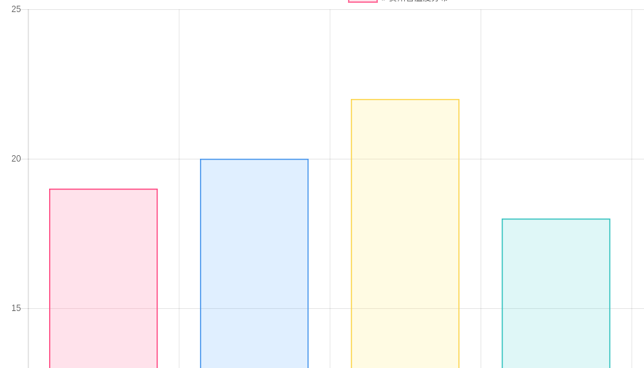

# 学习chart.js
##### 获取chart.js
去chart.js的官网，(http://www.chartjs.org/), 然后提供了三种可以获取chart.js的方式。我选择了第三种：```使用chart.js```CDN。
这是chart.js的CDN页面：(https://cdnjs.com/libraries/Chart.js)。

##### 创建文件
获得CDN后，我创建了一个名为test.html的文件，并且引入char.js CDN。为了页面美观，还需要引入bootstrapCDN：(https://maxcdn.bootstrapcdn.com/bootstrap/4.0.0-beta/css/bootstrap.min.css)。

##### 搭建结构
打开sublime，在test.html中输入下面的代码：
```javascript
<!DOCTYPE html>
<html>
<head>
  <title>Chart.Js使用测试</title>
  <meta charset="utf-8">
  <script src="https://cdnjs.cloudflare.com/ajax/libs/Chart.js/2.7.0/Chart.min.js"></script>
  <link rel="stylesheet" type="text/css" href="https://maxcdn.bootstrapcdn.com/bootstrap/4.0.0-beta/css/bootstrap.min.css">
</head>
<body>
<div class="container">
  <canvas id="myChart" width="400" height="400"></canvas>
</div>
<script type="text/javascript">
  let myChart = document.getElementById('myChart').getContext('2d');
  let chart = new Chart(myChart,{
    type: 'bar',
    data: {
      labels:["贵阳市", "毕节市", " 凯里", "六盘水", "都匀市"],
      datasets: [{
        label: '# 贵州省温度分布',
        data: [19, 20, 22, 18, 16],
        backgroundColor:[
               'rgba(255, 99, 132, 0.2)',
                'rgba(54, 162, 235, 0.2)',
                'rgba(255, 206, 86, 0.2)',
                'rgba(75, 192, 192, 0.2)',
                'rgba(153, 102, 255, 0.2)',
                ],
        borderColor:[
                'rgba(255,99,132,1)',
                'rgba(54, 162, 235, 1)',
                'rgba(255, 206, 86, 1)',
                'rgba(75, 192, 192, 1)',
                'rgba(153, 102, 255, 1)', 
                ],
                borderWidth: 1.5
      }]
    },
    options: {
        scales: {
            yAxes: [{
                ticks: {
                    beginAtZero:true
                }
            }]
        }
    }
});
</script>
</body>
</html>
```
期间，出现了两次错误：
1. </script>前面多了一个）}，导致无法运行。
2. ```let myChart = document.getElementById('myChart').getContext('2d');```错写成：```let myChart = document.getElementById('myChart').getContest('2d');```,导致运行出错。

修改上述两个错误后，成功运行了：

