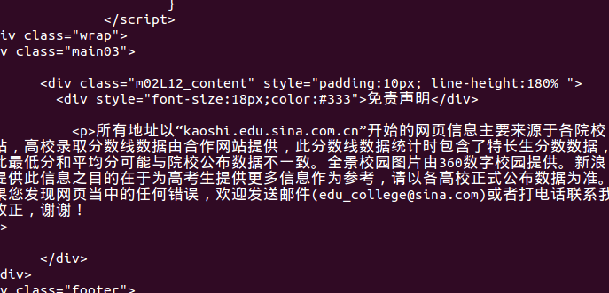

# 使用urllib2获取数据
1. 发起get请求
代码：

```python
#-*-  conding:utf-8-*-
import sys
reload(sys)
sys.setdefaultencoding('utf8')

import urllib2
import urllib

import json
from bs4 import BeautifulSoup
url = 'http://kaoshi.edu.sina.com.cn/college/scorelist?tab=batch&wl=1&local=2&batch=&syear=2013'

request = urllib2.Request(url=url)
response = urllib2.urlopen(request, timeout=20)
result = unicode(response.read())

print(result)
```

结果展示：


2. 发起POST请求
代码展示：

```python
url = 'http://shuju.wdzj.com/plat-info-initialize.html'
data = urllib.urlencode({'wdzjPlatId':59})
request = urllib2.Request(url)
opener = urllib2.build_opener(urllib2.HTTPCookieProcessor())
rseponse = opener.open(request, data)
result = response.read()
print(result)
```

3. python3代码：

```python
#-*-  conding:utf-8-*-
import urllib3
import urllib.request

import json
from bs4 import BeautifulSoup
#get
url = 'http://kaoshi.edu.sina.com.cn/college/scorelist?tab=batch&wl=1&local=2&batch=&syear=2013'
request = urllib.request.urlopen(url=url)
#response = urllib3.urlopen(request, timeout=20)
result = request.read().decode('utf8')

print(result)
#post
#url = 'http://shuju.wdzj.com/plat-info-initialize.html'
#data = urllib.parse.urlencode({'wdzjPlatId':59})
#request = urllib.request.urlopen(url)
#opener = urllib3.build_opener(urllib2.HTTPCookieProcessor())
#rseponse = opener.open(request, data)
#result = response.read()

#print(result)
```