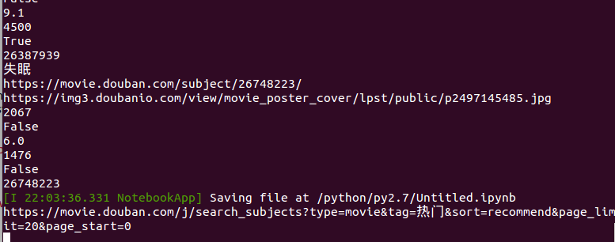

# 豆瓣电影爬虫升级
## V1.0.0
### 开发环境介绍：
```
系统: ubuntu14.04
IDE: anaconda3
python版本： V2.7.13(conda创建的虚拟环境)
```
### 结果过程演示：
###### 1.使用循环爬取所有分类、所有页面下的每一部电影：


###### 2.测试爬虫功能：输出电影标题测试爬虫是否正常工作：


###### 3.测试是否可以由电影分类获取的电影标题获得的电影的详情页面的源代码，测试是否正常工作：


###### 4.测试爬取过程是否正常，输出第一个分类的第一个页面下的所有电影来测试。并且把得到的结果写入txt文件：



###### 5.源代码
本次只是一些简单的操作，后续将进行生级、加强。
```python
#-*-  conding:utf-8-*-
import sys
reload(sys)
sys.setdefaultencoding('utf8')

import urllib2
import urllib

import json
from bs4 import BeautifulSoup as bs

tags = []
url ='https://movie.douban.com/j/search_tags?type=movie&source='
request = urllib2.Request(url=url)
response = urllib2.urlopen(request, timeout=20)
result = json.loads(response.read())
tags = result['tags']
#print(len(tags))
#for item in tags:
    #print(item)
movies = []
for tag in tags:
    limit = 0
    while 1:
        url = 'https://movie.douban.com/j/search_subjects?type=movie&tag=' + tag + '&sort=recommend&page_limit=20&page_start=' + str(limit)
        print url
        request = urllib2.Request(url=url)
        response = urllib2.urlopen(request, timeout=200)
        result = json.loads(response.read())
        result = result['subjects']
        if(len(result)==0):
            break
        limit +=20
        for item in result:
            movies.append(item)
        break
    break
    
for x in range(0, len(movies)):
    item = movies[x]
    request = urllib2.Request(url=item['url'])
    response = urllib2.urlopen(request, timeout=20)
    result = response.read()
    html = bs(result, 'html.parser')
    title = html.select('h1')[0].select('span')[0].get_text()
    #print title
    movies[x]['title'] = title

fw = open('/home/pzx/douban.txt', 'w')
for item in movies:
    tmp=''
    for key,value in item.items():
        #print(str(value))
        tmp += str(value) + ','
    fw.write(tmp[:-1] + '\n')
fw.close()
```
# 未完待升级...