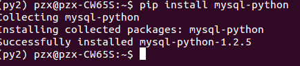
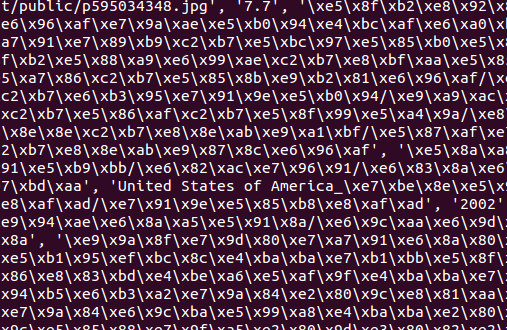
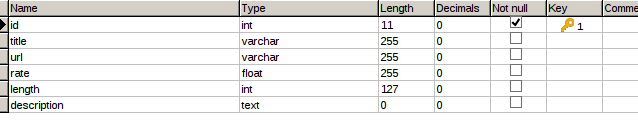
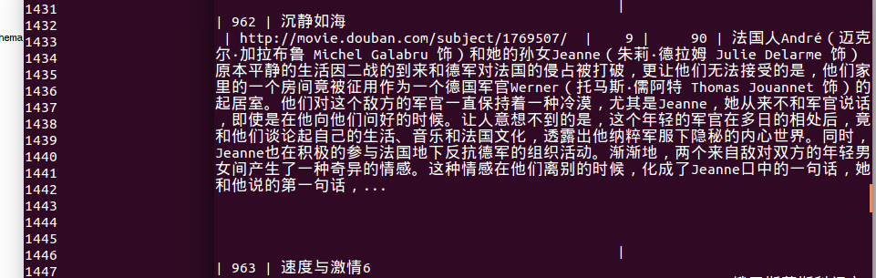

# Python 操作数据库
### 环境介绍
```
系统：ubuntu14.04 64位 LTS
python版本：2.7.13
IDE：jupyter notebook
```
###### 安装MySQLdb
```
$ pip install mysql-python
```
这样就是安装完成了：



###### 加载包
```python
import MySQLdb
import MySQLdb.cursors
```
###### 建立连接
```python
db = MySQLdb.connect(host='localhost', user='root', passwd='69615345', db='douban', port=3306,charset='utf8', cursorclass=MySQLdb.cursors.DictCursor)
db.autocommit(True)
cursor = db.cursor()
```
###### 读入数据
```python
fr = open('douban_movie_clean.txt', 'r')
count = 0
for line in fr:
    count +=1
    print count
    if count==1:
        continue
    line = line.strip().split('^')
    print line
fr.close()
```
数据读取结果：



###### 数据库中建表



###### 插入数据
```python
cursor.execute("insert into movie(title, url, rate, length, description) values(s%,s%, s%, s%, s%)", [line[1], line[2], line[4], line[-3], line[-1]])
```
插入成功：


###### 关闭连接
```python
cursor.close()
db.close()
```