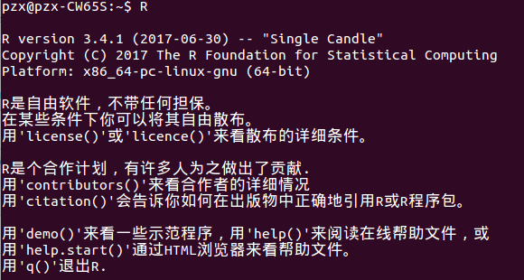
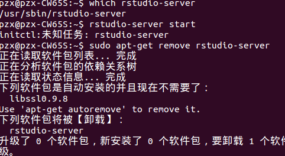

# ggplot2在R中的可视化
#### 1. 安装R
参考博客：(http://www.cnblogs.com/lijingchn/p/5419874.html)
1. 添加镜像源
```
$ sudo gedit /etc/apt/sources.list
#加入新镜像源：
deb http://cran.rstudio.com/bin/linux/ubuntu trusty/
```
2. 运行命令下载公钥
```
$ sudo apt-key adv --keyserver keyserver.ubuntu.com --recv-keys 51716619E084DAB9
$ sudo apt-get update
```
3. 安装R
```
$ sudo apt-get install r-base
```
完成后验证是否安装完成,在终端输入R：


显示这样的就是完成安装。

#### 2. 安装Rstudio
参考文章：(http://www.jianshu.com/p/2c739a25d20b)
```
$ sudo apt-get install gdebi-core
$ sudo apt-get install libapparmor1
$ wget http://download2.rstudio.org/rstudio-server-0.97.551-amd64.deb
$ sudo gdebi rstudio-server-0.97.551-amd64.deb
```
安装完成，但是无法运行，错误：



卸载重装，参考博文：(https://www.2cto.com/database/201702/594591.html)
