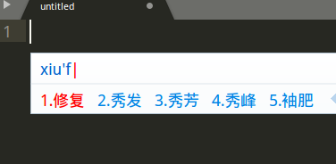

# sublime更新到最新版及配置
###### 更新sublime text3
参考官网：(https://www.sublimetext.com/docs/3/linux_repositories.html)

* 安装GPG key：

```
$ wget -qO - https://download.sublimetext.com/sublimehq-pub.gpg | sudo apt-key add -
```

* 选择安装的版本

  * 稳定版

   ```
   $ echo "deb https://download.sublimetext.com/ apt/stable/" | sudo tee/etc/apt/sources.list.d/sublime-text.list
   ```
   
  * 开发者版

   ```
   $ echo "deb https://download.sublimetext.com/ apt/dev/" | sudo tee/e /etc/apt/sources.list.d/sublime-text.list
   ```

* 更新软件源、安装sublime 

```
$ sudo apt-get update
$ sudo apt-get install sublime-text
```
###### 配置sublimetext3
安装完成后，打开sublime，需要输入秘钥：
```
TwitterInc
200 User License
EA7E-890007
1D77F72E 390CDD93 4DCBA022 FAF60790
61AA12C0 A37081C5 D0316412 4584D136
94D7F7D4 95BC8C1C 527DA828 560BB037
D1EDDD8C AE7B379F 50C9D69D B35179EF
2FE898C4 8E4277A8 555CE714 E1FB0E43
D5D52613 C3D12E98 BC49967F 7652EED2
9D2D2E61 67610860 6D338B72 5CF95C69
E36B85CC 84991F19 7575D828 470A92AB
```
输入完成后，就可以进入最新版的sublime界面了。

###### 解决无法输入中文
重新打开sublime后，悲催的发现，无法输入中文。我参考这篇文章解决了这个问题：(https://github.com/lyfeyaj/sublime-text-imfix)
**解决步骤**
* 1.克隆项目到本地
 ```
 $ git clone https://github.com/lyfeyaj/sublime-text-imfix.git 
 ```
* 2.运行脚本
 ```
 $ cd sublime-text-imfix && ./sublime-imfix
 ```
* 3.重启sublime，问题完美解决：

