# R可视化(September 18, 2017 9:09 AM)
##### 1. 安装rstudio
参考文章： (http://www.linuxidc.com/Linux/2016-07/133509.htm)
* 先从Rstudio的官网下载自己系统的安装文件：(http://www.rstudio.com/products/rstudio/download/)
安装完成：


* 然后再执行以下命令,安装RStudio-server：

```
$ sudo apt-get install gdebi-core
$ wget https://download2.rstudio.org/rstudio-server-0.99.902-amd64.deb
$ sudo gdebi rstudio-server-0.99.902-amd64.deb
```
安装完成后，在浏览器中输入地址和端口：http://localhost:8787,成功打开RStudio-server：

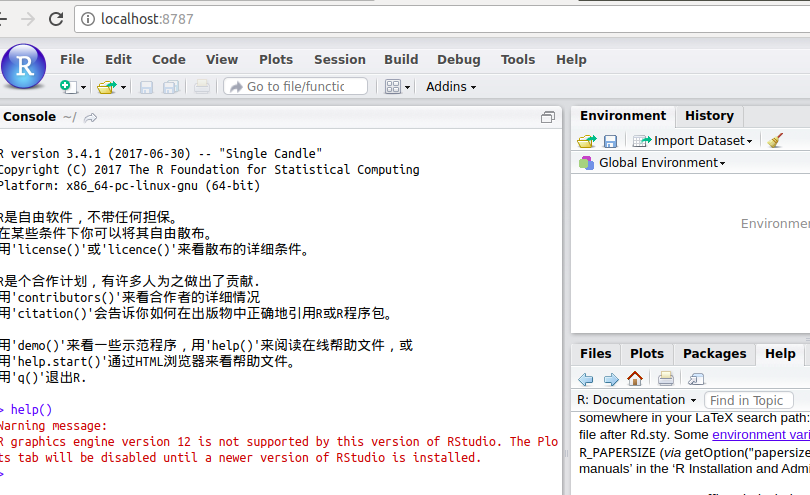

##### 2.Rstudio安装ggplot2
在打开了rstudio-server界面的命令行中输入```> install.packages("ggplot")```即可，安装包下载中：

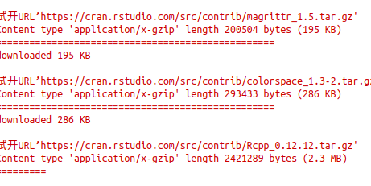

安装完成September 18, 2017 9:10 AM：

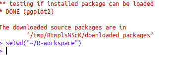

##### 3.加载包
1.新建脚本文件

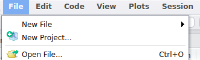

在new file选择第一个：Rscript

2.加载包，打开新建的脚本：

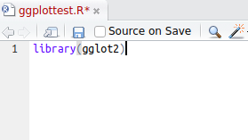

##### 4.从CSV文件读取数据

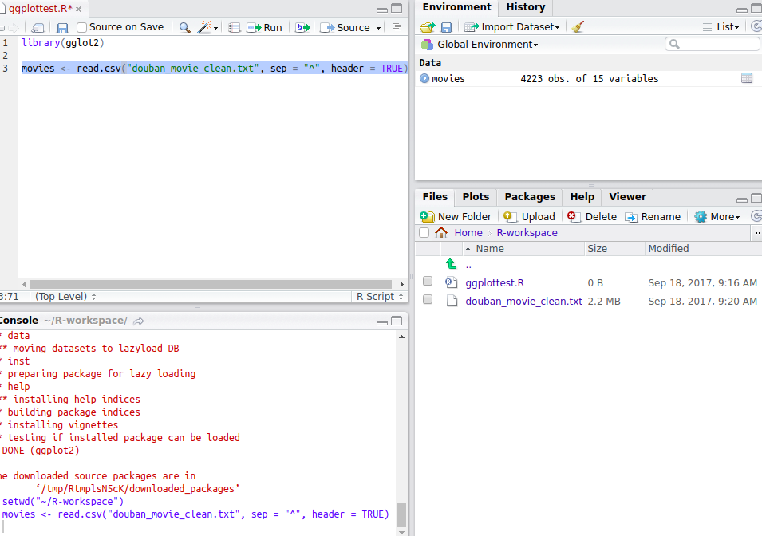

输入```movies <- read.csv("douban_movie_clean.txt", sep = "^", header = TRUE)```，然后选中，点击```RUN```，即可运行，在右边数据区域，可以看到已经成功读取到了csv文件

###### ggplot绘图测试
上一步骤已经读取到了csv文件，现在，用它来绘制一个简单的图形。先用电影的时长来绘图，以时长为x轴，查看电影时长分布情况：
结果出错了：

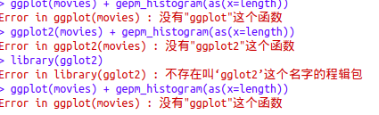

仔细检查了一下，发现是加载包的时候少打了一个字母：```library(ggplot2)```打成了```library(gglot2)```,改掉后再次运行：

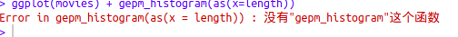

又报错了，还是函数名字打错了，```ggplot(movies) + gepm_histogram(as(x=length))```改为：```ggplot(movies) + geom_histogram(as(x=length))```，再次运行：


又又出错，还是字母打错了，这次少了个单词。```ggplot(movies) + geom_histogram(as(x=length))```改成```ggplot(movies) + geom_histogram(aes(x=length))```,运行，又报错：

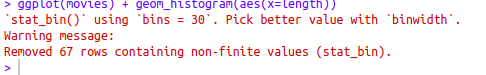 September 18, 2017 3:01 PM 

参考这篇文章： (http://blog.csdn.net/qq_16365849/article/details/50651524) (September 18, 2017 3:10 PM),把代码改成：

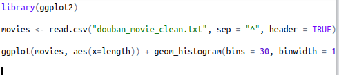

运行失败：
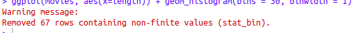

再参照ggplot2的官方文档： (http://ggplot2.tidyverse.org/reference/geom_histogram.html), September 18, 2017 3:15 PM

终于解决了：September 18, 2017 6:15 PM
###### 问题：
1.我原来的版本过旧，无法打开客户端，只能在网页上打开服务端
2.服务端绘图不能调用Ubuntu终端，不能打开绘图窗口。
**成功运行后的样子：**

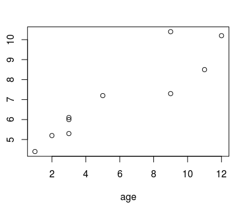

###### 把刚才的代码重新再运行一遍

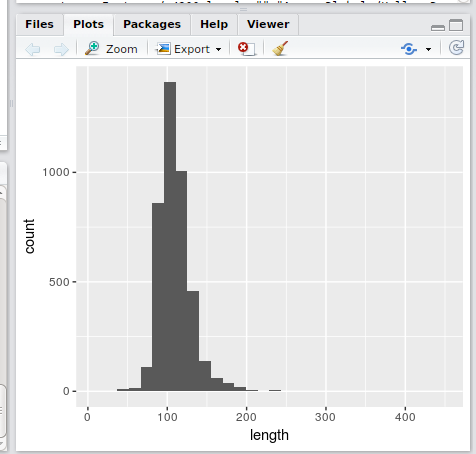
可以清楚的看到，大多数电影的时长都在120分钟左右。

##### 附A：变量类型
1.向量
2.矩阵
3.数组
4.数据框：类似excel的表格，可以是包自带的，也可以从csv中读取
5.因子：离散的
6.列表
