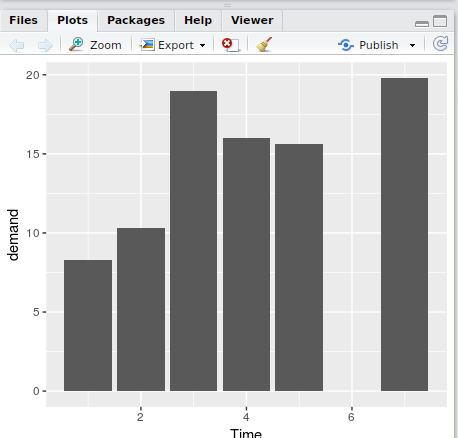
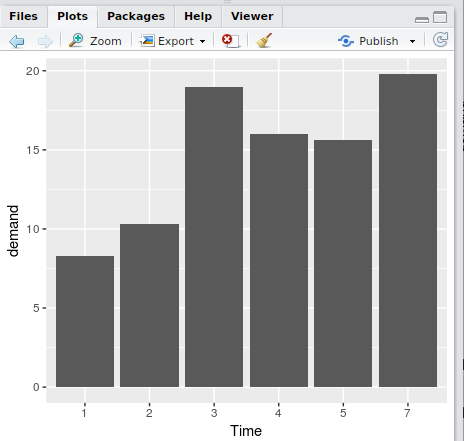
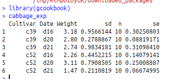
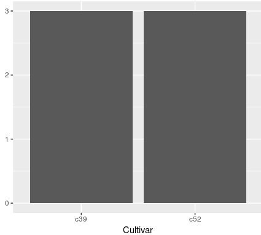
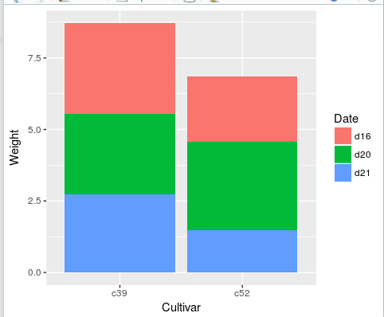
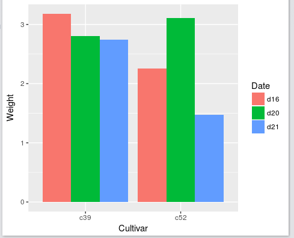
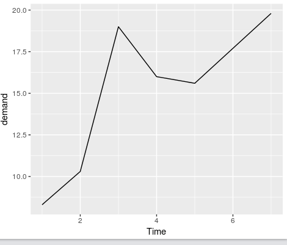
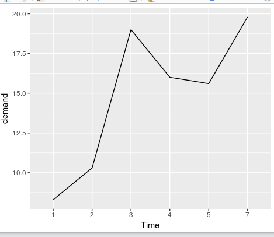
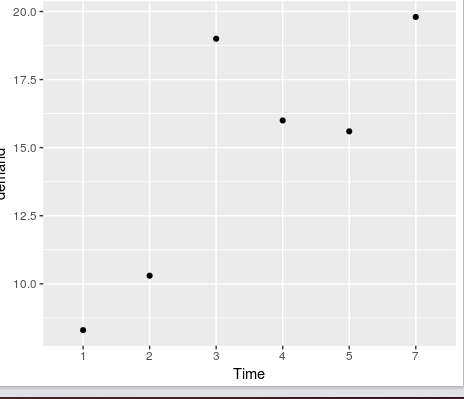
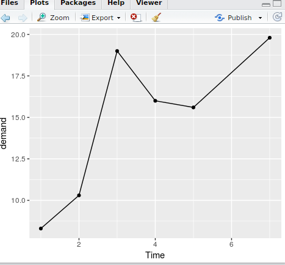

# ggplot2基本语法和基础图形
#### 背景
有哪些图形：散点图、折线图、面积图、条形图、直方图、箱线图...
绘图元素： shape、color、fill...
还有：x轴、y轴、标题、图例...

#### 基本语法
```ggplot(data) + geom_type()```

元素映射：将某一变量(连续或离散)映射到shape、color、fill等元素上

###### 条形图Bar
y为频数、y为变量值、分组条形图
```R
library(ggplot2)

ggplot(BOD) + geom_bar(aes(x=Time, y=demand), stat='identity')

```


访问知道名字的某一行:
```> BOD['Time']```
访问第一行：
```> BOD[1]```

```> BOD[，1]```

```> BOD$Time```

将某一行转成因子：
```> BOD$Time <- factor(BOD$Time)```

将BOD的Time列转换成因子后的样子：



y作为频数：
加载新的数据：



y作为频数绘图：
```> ggplot(cabbage_exp) + geom_bar(aes(x=Cultivar))```

显示：



###### 分组条形图
```R
> ggplot(cabbage_exp) + geom_bar(aes(x=Cultivar,y=Weight,fill=Date), stat="identity")
```
执行结果：



换个方式排放：
```R
> ggplot(cabbage_exp) + geom_bar(aes(x=Cultivar,y=Weight,fill=Date), stat="identity",position="dodge")
```



####### 折线图
```R
library(gcookbook)
library(ggplot2)
#连续变量的情况
ggplot(BOD, aes(x=Time, y=demand)) + geom_line()
#离散变量的情况
BOD1 <- BOD # 赋值数据
BOD1$Time <- factor(BOD1$Time)#变量因子化
ggplot(BOD1, aes(x=Time, y=demand, group=1)) + geom_line(linetype="dotted")
```
结果1：



结果2：


###### 散点图
```R
> ggplot(BOD) + geom_point(aes(x=Time,y=demand))
```
结果1：



结果2，散点图和折线图一起：
```R
> ggplot(BOD, aes(x=Time,y=demand)) + geom_line() + geom_point(aes(x=Time,y=demand))
```
