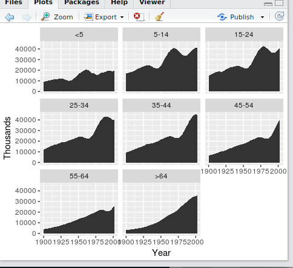

# ggplot2基本语法和基础图形2
加载新的数据：
```R
> uspopage
> us <- uspopage
> ggplot(us) + geom_line(aes(x=Year, y=Thousands))
```
查看一下数据：


结果展示：


按年龄段：
```R
> ggplot(us) + geom_line(aes(x=Year, y=Thousands, color=AgeGroup))
```


区域图：
```R
> ggplot(us) + geom_area(aes(x=Year, y=Thousands, color=AgeGroup))
```
结果展示：


换种形式：
```R
> ggplot(us) + geom_area(aes(x=Year, y=Thousands, fill=AgeGroup))
```

show:


一图多画：
```R
> ggplot(us) + geom_area(aes(x=Year, y=Thousands)) + facet_wrap(~AgeGroup)
```

result show:

