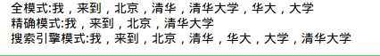
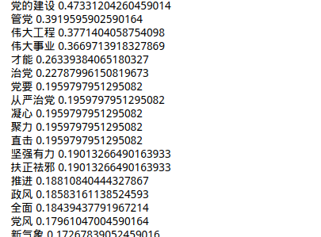
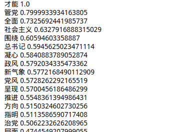

# NLP 走近自然语言处理
Natural Language Processing/Understanding,(NLP)自然语言处理

###### 1.jieba中文分词
* 安装jieba分词
```
$ pip install jieba
```
* 使用jieba分词

```python
#-*- conding:utf-8 -*-
import jieba

seg_list = jieba.cut(u"我来到北京清华大学", cut_all=True) #全模式，匹配所有可能的组合情况

print("全模式:" + "，".join(seg_list) ) 

seg_list = jieba.cut(u"我来到北京清华大学", cut_all=False) #精确模式，匹配最有可能的组合情况

print("精确模式:" + "，".join(seg_list) )

seg_list = jieba.cut_for_search("我来到北京清华大学")  # 搜索引擎模式

print("搜索引擎模式:" + "，".join(seg_list))
```


* 提取关键词
```python
#-*- conding:utf-8 -*-
import jieba.analyse
content = u"中国特色社会主义是我们党领导的伟大事业，全面推进党的建设新的伟大工程，是这一伟大事业取得胜利的关键所在。党坚强有力，事业才能兴旺发达，国家才能繁荣稳定，人民才能幸福安康。党的十八大以来，我们党坚持党要管党、从严治党，凝心聚力、直击积弊、扶正祛邪，党的建设开创新局面，党风政风呈现新气象。习近平总书记围绕从严管党治党提出一系列新的重要思想，为全面推进党的建设新的伟大工程进一步指明了方向。"
#基于TF-IDF（词频）
keywords = jieba.analyse.extract_tags(content, topK=20, withWeight=True, allowPOS=())
for item in keywords:
    print(item[0],item[1])
#基于TextRank（反向文本）
print("#########################")
keywords = jieba.analyse.textrank(content, topK=20, withWeight=True, allowPOS=('ns', 'n', 'vn', 'v'))
for item in keywords:
    print(item[0],item[1])
```
**结果展示，基于TF-IDF：**



**基于TextRank：**

