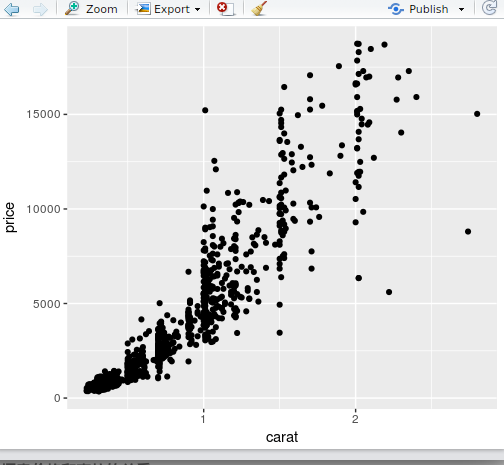

# 实战 Diamonds数据集探索

###### 1. 加载包和数据集
```R
library(ggplot2) //加载包
library(gcookbook) //加载数据
diamonds <- diamonds //数据赋值
```

###### 2. 生成随机数种子，截取数据集子集
```R
set.seed(123) //生成随机数种子
diamonds <- diamonds[sampile(nrow(diamonds),1000),] //截取整个数据集发前1000行
```

###### 3. 查看数据集的基本信息
```R
summary(diamonds)
```
**show result:**


可以清晰的看到，它很详细的统计了每一列的基本信息,如：最大值、最小值、中位数...
```R
str(diamonds) //查看一些行和列的基本信息
```
**show result:**


```R
head(diamonds) //查看前几行,默认是前6行的所有列
```
**show result：**


###### 4. 绘制散点图，探索价格和克拉的关系
```R
ggplot(diamonds,aes(x=carat, y= price)) + geom_point()
```
**show result:**



丰富函数：指定钻石的color为散点图的填充，cut映射为散点的行状
```R
//点图填充用shape
ggplot(diamonds,aes(x=carat, y= price, color=color, shape=cut)) + geom_point()
```
**看一下，比刚才的漂亮多了：**


###### 5. 列名操作
```R
names(diamonds) //查看所以的列名
names(diamonds) <- c("e1", "e2",...,"en") //改变列名
``` 

###### 6. 价格分布
直方图展示(x轴为连续值)：
```R
//以价格为x轴绘制直方图，直方图的x轴为连续值，没有取值的地方为空。
ggplot(diamoonds,aes(x=price)) + geom_histogram() //统计每个价格区间的钻石的数量
```
运行代码后，可以清楚的看到：钻石的价格5000以下的比较多。


用cut为形状填充一下：
```R
//区域图填充用fill
ggplot(diamoonds,aes(x=price,fill=cut)) + geom_histogram()
```


###### 7. 透明度的分布
```R
ggplot(diamondas,aes(x=clarity)) + geom_bar() //统计每个透明度的钻石数量
```
**绘图结果：**


由图可知，S11这个透明度的钻石数量最多。

###### 8. 价格概率（密度）分布
```R
gglot(diamonds,aes(x=price)) + geom_density()
```
**运行结果：**


不同工艺的钻石的价格：
```R
gglot(diamonds,aes(x=price，color=cut)) + geom_density()
```
**结果展示：**


###### 9. 箱线图
```R
ggplot(diamonds,aes(x=cut,y=price)) + geom_boxplot()
```
**show:**


###### 10. 坐标变换
把第4中得到的散点图进行坐标变化：
```R
ggplot(diamonds,aes(x=carat, y=price,color=color,shape=cut)) + geom_point() + scale_y_log10()
```
**坐标变换前：**


**坐标变换后：**


###### 附：坐标轴标签和标题
```R
ggplot(diamonds,aes(x=carat, y=price,color=color,shape=cut)) + geom_point() + scale_y_log10() + labs(x='克拉',y='价格',title=‘钻石价格-克拉关系图’) + theme(text = element_text(family = "DroidSansFallbackFull"))
```
**Look!**

