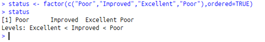

# R语言基础-创建数据集
#### 输入和输出
R使用source("filename")载入脚本，使用sink("filename")将结果输出到文档中

###### 包的安装、更新、加载
install.packages("包的名字") //安装
update.packages("包的名字") //更新
library(包的名字) //加载
help(package="包的名字") //查看包的帮助信息，包括函数名和数据集列表

1.选择一种数据结构来存储数据；
2.将数据输入或者导入到这个数据结构中。

#### 数据结构
R拥有许多用于存储数据的对象类型，包括标量、向量、矩阵、数组、数据框和列表:


##### 1.向量
用于存储数值类型、字符型或者逻辑型数据的一维数组，单个向量中的数据必须拥有相同的类型或模式：

```R
a <- c(1,2,5,3,6,-2,4)
b <- c("one","two","three")
c <- c(TRUE,TRUE,TRUE,FALSE,TRUE,FALSE)
```

用方括号访问向量中的元素，如访问向量a中的第二个和第四个元素：

```R
a[c(2,4)] //下标从1开始
```

支持冒号语法，以下将返回向量a中的第二个到第6个元素
```R
a[2:6]
```

##### 2.矩阵
矩阵是一个二维数组，每个元素拥有相同的模式(数字型、字符型或逻辑型)，通过函数matrix创建矩阵。
```R
mymatrix <- matrix(vector, nrow=number_of_rows,ncol=number_of_columns,byrow=FALSE,dimnames=list(rownames,colnames))
```
其中 ```vector``` 向量包含了矩阵元素，```nrow``` 和```ncol``` 为行数和列数， ```byrows``` 默认为 ```FALSE```   表示按列填充，否则 ```TRUE```为按行填充,dimnames为行列名，使用时，只有前三个参数是必须的x[i,]表示矩阵x中的第i行,x[,j]表示矩阵x中的第j列,x[i,j]表示矩阵x中的第行第j个元素，或者使用数值型向量代替i、j 来选择多行多列
**show 创建矩阵时默认byrow=FALSE,按列填充：**


**如果byrow=TRUE则按行填充：**


**取多列（取第一列和第二列）：**


**取多行（取第一行和第二行）：**


**取多行、多列（取第一行和第二行，再取第一行和第二行的第三四列）：**


##### 3.数组
数组和矩阵类似，但是维度可以大于2，通过array函数创建。
```R
myarray <- array(vector,dimensions,dimnames)
```

其中 ```vector``` 包含数组中的数据，```dimensions``` 是一个数值型向量，给出了各个维度下标的最大值，```dimnames``` 可选，表示各维度的名称标签的列表。
**LOOK，数组的填充方式为按列填充，且无法指定按列填充：**


**上面的是一个二维数组；但是没有列名，下面展示一个有行和列名的二维数组：**


首先，定义好数组的行列名称放在数组里，然后在创建数组的时候引用就行。
**接下来，将展示一个三维数组：**


##### 4.数据框(一）
可以理解成数据库的表，特点是不同的列可以包含不同模式（数值型，字符型等）数据，但是每一列的数据模式必须相同。通过 ```data.frame``` 创建数据框
```R
patientID <- c(1,2,3,4)
age <- c(25,34,28,52)
diabetes <- c("Type1","Type2","Type1","Type1")
status <- c("Poor","Improved","Excellent","Poor")
patientdata <- data.frame(patientID,age,diabetes,status)
```

**创建完成：**


访问数据可以通过一下三种方式：
**1.all[1:2]:**


**2.all[c("age","status")]**


**3.all$age**


##### 4.数据框（二）
**数据框生成列联表：**
```R
table(all$patientdataID,all$status)
```
**整个数据框：**


**列联后的数据框：**


例如第一个列联表：
选取patientdataID那一列的所有元素作为列名，然后再选取status的所有元素作为行名，然后行列依次组合，如果在数据框中存在这种（i,j)组合，累加一次。

**attach()将数据框添加至R的搜索路径
detach()将数据框移除R的搜索路径**
很好理解，添加到R搜索路径之后，就可以直接用列名访问数据框中的列了。考虑到命名冲突的问题，函数attach()和detach()最好在分析一个单独的数据框，并且不太可能有多个同名对象时使用。任何情况下，都要当心那些告知某个对象已被屏蔽(masked)的警告，意味着之后以这些名称命名的变量将被屏蔽。
**attach之后：**


**除此之外，还可以使用with()函数：**
```R
with(数据框名,{
summary(数据框内的列名）
}）
```


由于大括号{}之间的语句都针对patientdata执行，所以不存在命名冲突的问题。主要注意的是，如果在大括号里面进行了变量赋值操作，在大括号外面讲无法访问该变量，除非是用特殊赋值符<<-。不妨试试以下代码，temp仅能在大括号内部访问，perm则可以在外部访问。
```R
with(数据框名字, {
    temp <- summary(数据框内的列名)
    perm <<- summary(数据框内的列名)
    temp
})
temp
perm
```
另外，可以使用row.names指定数据框的实例标识符（差不多就是主键的意思吧）。

##### 5.因子
类别（名义型）变量和有序类别（有序型）变量在R中称为因子（factor）。因子在R中非常重要，因为它决定了数据分析方式如何进行视觉呈现。

* 对于**类别值**，函数factor将其映射为整数：
```R
test <- factor(c("Type1","Type2","Type1","Type2"))
```
其将**Type1**映射为1、**Type2**映射为2。
    
     

* 对于**有序型**，函数factor将其按字母顺序映射(需要增加参数ordered=TRUE表明当前处理的是有序型变量)：
```R
status <- factor(c("Poor","Improved","Excellent","Poor"),ordered=TRUE)
```
其将**Excellent**映射为1、**Improved**映射为2、**Poor**映射为3。

     

* 可以使用level来指定有序型的顺序：
```R
status <- factor(c("Poor","Improved","Excellent","Poor"),ordered=TRUE,levels=c("Poor","Improved","Excellent"))
```
其将**Poor**映射为1、**Improved**映射为2、**Excellent**映射为3。
     
     
##### 6.列表
列表的每个元素可以是以上提及的任何数据类型，甚至其他列表的组合，使用 ```list``` 定义，可以为各个元素命名
```R
> a <- "I'm first list"
> b <- c(128,256,512,1024)
> c <- c("one", "two", "three")
> d <- matrix(1:10,nrow = 5)
> mylist <- list(title=a,ages=b,c,d)
> mylist
```
**可以看到mylist包括四个元素:**


**使用mylist[[2]]或者mylist[[“ages”]]访问第二个元素。**

