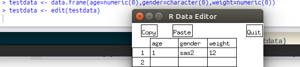

# R语言基础
### 2. 数据输入(一)
R可以从键盘、文本文件、Microsoft Excel和Access、流行的统计软件、特殊格式的文件，以及多种关系型数据库中导入数据。


##### 1.使用键盘输入数据

可以使用键盘编辑变量的值：
1. 创建一个空数据框（或者矩阵），其中变量名和变量的模式需要与理想中的最终数据集一致；
2. 针对这个数据对象调用文本编辑器，输入你的数据，讲结果保存回这个数据对象中。

使用以下代码来手动编辑一个变量：
```R
testdata <- data.frame(age=numeric(0),gender=character(0),weight=numeric(0))
testdata <- edit(testdata)
```
**执行该命令后，会弹出一个编辑框，用来输入数据：**



数据输入完毕后点击**Quit**退出，然后查看一下我们刚才输入的数据：


ok,输入完成。

##### 2.从带有分隔符的文本文件导入数据
可以使用 ```read.table()``` 从带分隔符的文本文件中导入数据，该函数可以读入一个表格格式的文件并将其保存为一个数据框：
```R
testdata <- read.table(file,header=TRUE/FALSE,sep="分隔符类型",row.names="name")
```
**代码解读：** ```file``` 是一个带分隔符的ASCII文件，```header``` 表示首行是否包含变量名， ```sep``` 表示分隔符， ```row.names``` 可选，用来指定一个或者多个表示标识符的变量（**主键**）。

**举个例子：**
```R
drivers <- read.tables("城配师司机数据.csv",header=TRUE,sep=",")
drivers
```
**读取结果：**


查看关于更多微调数据导入方式的追加选项，请参阅help(read.table)。

##### 3.导入excel数据
读取一个Excel文件的最好方式，就是在Excel中将它导出为CSV（逗号分隔）。
###### 安装xls出现错误：


原因是在安装过程中，无法加载Java，因为rstudio无法读取java的安装路径。先为java加个环境变量试试(**September 21, 2017 4:07 PM 开始时间**),终于找到了一篇文章：(http://www.jianshu.com/p/517d60598537)

根据提示，打开终端，链接R与Java：
```
$ R CMD javareconf
```
**执行，显示：**


**失败**


许久（**September 21, 2017 4:43 PM 解决时间**）,
我找到又一篇文章：（http://www.cnblogs.com/zhangduo/p/4440314.html）
根据提示，使用另一个包：
```R
install.packages("readxl")
```
安装成功了！！接下来，介绍一下它的使用方法：
```R
library(readxl)
test <- read_excel(file,sheet=num)
```
**展示一下我的读取结果：**


**读取到的excel:**


##### 4.导入XML文件
XML是一种文件格式，它使用标准ASCII文本共享万维网，内部网和其他地方的文件格式和数据。 它代表可扩展标记语言（XML）。 类似于HTML它包含标记标签。 但是与HTML中的标记标记描述页面的结构不同，在xml中，标记标记描述了包含在文件中的数据的含义。
**安装XML包：**
```R
install.packages("XML")
```
**载入XML包：**
```R
library（XML）
```
**读取XML文件：**
xml文件由R语言使用函数 ```xmlParse()``` 读取：
```R
library("XML")
library("methods")
result <- xmlParse(file)
```
安装失败：


这一次是依赖的问题，我找到了这篇博文：(https://www.oschina.net/question/140230_2184270)
发现了两个有趣的命令：
```
$ sudo aptitude update 
$ sudo aptitude install build-essential
```
是依赖版本过高，运行下面的命令把它降下来：


**然后打开终端，运行：**
```
$ sudo R
> install.packages("XML")
```
**安装成功：**


**读取成功了：**


