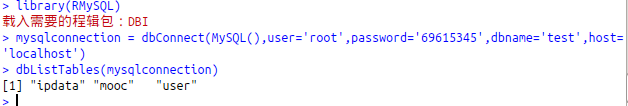
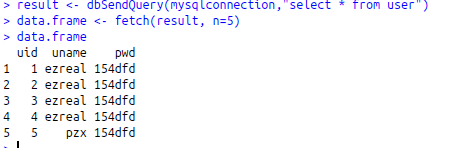

# R语言基础
### 2.读取数据
##### 5.R语言连接数据库
**1.安装数据库包：**
```
install.packages("RMySQL")
```
**2.将R连接到MySQL：**
```R
library(RMySQL)
mysqlconnection <- dbConnect(MySQL(),user='root',password='',dbname='',host='localhost')

dbListTables(mysqlconnection)
```
**3.代码实践：**
连接到我的数据库：
```R
mysqlconnection <-dbConnect(MySQL(),user='root',password='69615345',dbname='test',host='localhost')
 dbListTables(mysqlconnection)
```
**成功连接了数据库，结果如下：**



**4.查询表：**
我们可以使用函数 ```dbSendQuery()``` 查询Mysql中的数据表。查询在MySQL中执行，并且使用R语言 ```fetch()``` 函数返回结果集。最后，它被存储为R语言中的数据帧。
```R
result <- dbSendQuery(mysqlconnection,"select * from user")
data.frame <- fetch(result,n=5)
data.frame
```
**查询结果：**



###### 其余的操作类似MYSQL操作，例如：插入数据、删除数据...。
**5.创建表**
```R
dbWriteTable(mysqlconnection, "mtcars", mtcars[, ], overwrite = TRUE)
```

### 2.4 处理数据对象的实用函数
* length()：显示对象中元素/成分的数量；
* dim(object)：显示对象的维度；
* str(object)：显示对象的结构；
* class(object)：显示对象的类或类型；
* mode(object)：显示对象的模式；
* names(object)：显示对象中各成分的名称；
* c(object, object,…)：将对象合并成向量；
* cbind(object, object, …)：按列合并对象；
* rbind(object, object, …)：按行合并对象；
* Object：输出某个对象；
* head(object)：列出对象的前六个元素；
* tail(object)：列出对象的后六个元素；
* ls()：显示当前的对象列表；
* rm(object, object, …)：删除一个或多个对象，rm(list=ls())将删除当前工作空间中的几乎所有对象；
* newobject <- edit(object)：编辑对象并另存为newobject；
* fix(object)：直接编辑对象。
