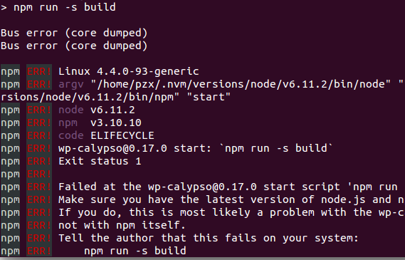

# Node+wordpress安装报告

#### 1.寻找wordpress用Node重写的相关项目
打开Google浏览器，输入关键词 `wordpress node`,得到许多结果，我选择第二个：


进入后是这个样子：


然后，我点击 **`Github project`** 按钮，进入到了github页面：


项目找到了，接下来，开始安装

#### 2.安装wp-calypso
在Google浏览器中输入关键字：**`How to install WP Calypso on Ubuntu14.04`**
然后我找到了这篇文章： (https://www.digitalocean.com/community/questions/how-to-install-wp-calypso-in-a-droplet-ubuntu), 根据文章的提示，我点了文章中的链接 (https://github.com/Automattic/wp-calypso/blob/master/docs/install.md) ，跳转到了github页面：


根据提示，开始安装：
```
pzx@pzx-CW65S:~$ git clone https://github.com/Automattic/wp-calypso.git
```


一段时间后，安装完成，进入项目文件夹并且运行：
```
pzx@pzx-CW65S:~$ cd wp-calypso
pzx@pzx-CW65S:~/wp-calypso$ npm start
```
运行 `npm start`后，它会自动安装所有需要用到的依赖并且运行服务，


**依赖安装完成，服务器已经启动：**


打开浏览器，输入 (http://calypso.localhost:3000) ,**运行失败**：
**浏览器：**


**终端：**


我又仔细的看了教程，找到了这样一段话：
```
To run Calypso locally, you'll need to add 127.0.0.1 calypso.localhost to your hosts file, and load the app at http://calypso.localhost:3000 instead of just localhost. This is necessary, because when running locally Calypso is using the remote version of the WordPress.com REST API, which allows only certain origins via our current authentication methods.
```
在本地运行时，要把 `127.0.0.1 calypso.localhost` 添加到`Hosts`文件中**（September 26, 2017 3:19 PM 实验室有人来检查，暂停去实验室）**  **(September 26, 2017 4:21 PM 暂停结束，继续)**

在我的`hosts`文件中加入 `127.0.0.1 calypso.localhost`：


重启电脑，再次运行试试。（**Reboot** September 26, 2017 4:25 PM）
**再次运行：**


还是出错了，好像是我的Node版本比较低，先安装`yarn`试试，我找到的关于安装`yarn`的文章： (https://yarnpkg.com/zh-Hans/docs/install)
<p>安装失败，还是先安转一个高版本的NodeJs试试吧。


**Node v6.11.3安装完成**


终于把所有的东西都安装好了，再次运行：


结果又报错了：


我又在网上查阅了一下，发现好像要使用`vagrant`,比较麻烦，我果断放弃了，无意间我又点开了这个网站 (https://developer.wordpress.com/calypso/),这次我点击这个按钮：


下载了一个Ubuntu的安装包，很快就安装好了，这是运行界面：
**这是APP的样子：**


**这是github上在网页上的样子：**


用源码安装完成后也是这也样子，不过好像只能在网页打开，APP就方便多了，它的架构好像是 `Nodejs+WordPress + ReactJS`。
虽然安装好了，但是对它还不了解，先用用吧。（**September 26, 2017 9:12 PM Over**）