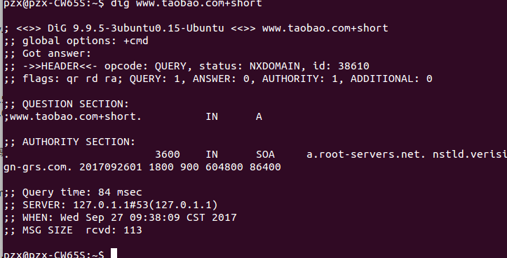

# ubuntu14.04设置阿里公共DNS
原文链接 (http://www.alidns.com/setup/#linux)
##### Linux通用设置

###### 以下命令必须以root身份运行或者取得root权限
```
$ sudo vim /etc/resolv.conf
然后加入:
nameserver 223.5.5.5
nameserver 223.6.6.6
```
保存退出，使用`dig`验证
```
$ dig www.taobao.com+short
```
若出现结果就是正常的。

##### Ubuntu快捷设置
设置使用阿里公共DNS
```
$ wget http://www.alidns.com/static/soft/SetAliDNS.sh -O SetAliDNS.sh && chmod +x SetAliDNS.sh
$ sudo ./SetAliDNS.sh
```

取消使用：
```
$ sudo ./SetAliDNS.sh restore
```
设置成功：

