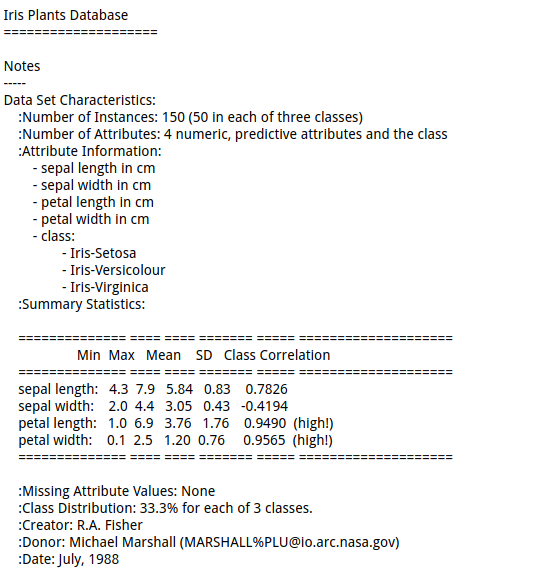

# 数据挖掘学习
#### 前期准备
1. python(3.6.1)
2. ipython
3. scikit-learn库

###### 安装scikit-learn库
``
$ pip install scikit-learn 
``
#### 1. 亲和性分析
##### 1.1 什么是亲和性分析
亲和性分析根据样本个体(物体)之间的相似度，确定它们关系的亲疏。亲和性分析的应用场景如下
* 向网站用户提供多样化的服务或投放定向广告。
* 为了向用户推荐电影或商品，而卖给他们谢谢与之相关的东西。
* 根据基因寻找有亲缘关系的人。

##### 1.2 Numpy加载数据集
```python
# -*- coding:utf-8 -*-
import numpy as np 

data_name = "../datas/affinity_dataset.txt"
x = np.loadtxt(data_name)
print(x[:5])
```
##### 1.3 分类
分类应用的目标是,根据已知类别的数据集,经过训练得到一个分类模型,再用模型对类别未知的数据进行分类。

接下来将使用著名的Iris植物分类数据集。这个数据集共有150条植物数据,每条数据都给出了四个特征:sepal length、sepal width、petal length、petal width(分别表示萼片和花瓣的长与宽),单位均为cm。该
数据集共有三种类别:Iris Setosa(山鸢尾)、Iris Versicolour(变色鸢尾)和Iris Virginica(维吉尼
亚鸢尾)。我们这里的分类目的是根据植物的特征推测它的种类。

scikit-learn 库内置了该数据集,可直接导入。
```python
from sklearn.datasets import load_iris #scikit-learn 库内置了该数据集,可直接导入。

dataset = load_iris()  #载入Irid植物分类数据集，是一个JSON文件
x =dataset.data #读取dataset中的‘data'
y = dataset.target
print(dataset.DESCR) #查看数据集的基本情况
```
**数据集的基本信息：**



