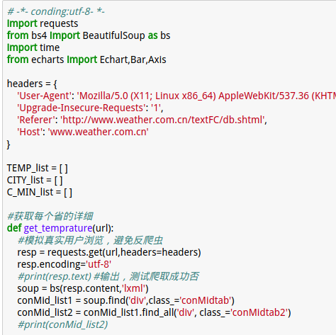
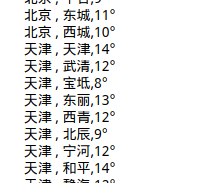
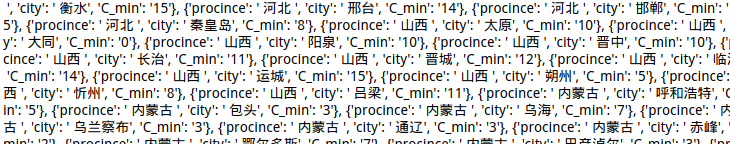

# python爬取中国各市的最低温度
##### 环境介绍：
```
python 3.6.0
jupyter
代码兼容py3和py2
```
##### 步骤介绍：
1. 先获取中国天气预报页面的URL (http://www.weather.com.cn/textFC/hb.shtml) 
2. 由获得的URL得到源码，找到各个地区的URL
3. 用各个地区的URL获得各个市的天气情况
4. 提取省的名称、市的名称、最低温度
5. 储存数据

##### 代码读
代码主要部分是两个函数：
1.`get_areas(url)`，获得页面源代码，再由源代码获得每个页面的URL
2.`get_temprature(url)`，根据`1`函数得到的结果获得每个省的每个市的天气

##### 结果展示：
**代码片段：**



**爬取结果：**



**储存结果：**



##### 可视化
时间晚，明日进行(September 28, 2017 11:26 PM)