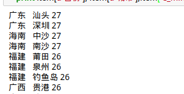
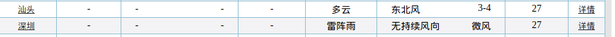
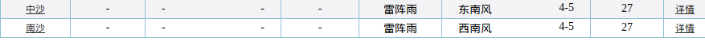
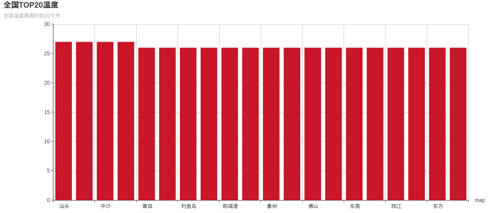

# 中国天气数据处理、可视化
昨天，我获取到了全国各个市的天气情况，并且将获取的数据保存下来。现在，我们将加载保存的数据，进行简单处理，然后利用echarts可视化。
##### 0.工作环境
```
由于python3使用echart画图时无法正常显示图像，所以我用conda创建了一个名为py2的虚拟机。
python：2.7.13
jupyter notebook2
```
##### 1.加载数据
昨天，把数据保存为Json文件了，所以，先加载它：
```python
with open(u'温度数据.json','r') as fr:
    data = json.load(fr)

```

##### 2.处理
加载完成后，要对数据按温度进行**降序**排序，选出前20个城市。

**代码：**
```Python
import json
with open(u'温度数据.json','r') as fr:
    data = json.load(fr,encoding='utf-8')

sorted_list = sorted(data,lambda x,y:cmp(int(x['C_min']),int(y['C_min'])),reverse=True#表示降序排序)
for item in sorted_list[:20]: #取排好后的前20个城市
    print item[u'城市'],item['C_min']
```
**代码解读：**
```
sorted_list = sorted(data,lambda x,y:cmp(int(x['C_min']),int(y['C_min'])),reverse=True)
```
`sorted`在python2和Python3中的区别：
* 在Python3中，sorted的cmp属性被弃用：`sorted(iterable, key=None, reverse=False)`，**具体用法：**`sorted(min, key=lambda x: x['C_min'], reverse=True)`；如果要在Python3中使用`cmp`,这样就行：`min.sort(key=cmp_to_key(lambda a, b: int(a['C_min']) - int(b['C_min'])))`。

* 在Python2中：`sorted(iterable, cmp=None, key=None, reverse=False)`，**具体用法：**`sorted(data,lambda x,y:cmp(int(x['C_min']),int(y['C_min'])),reverse=True)`。

展示一下我的**排序结果：**



打开网页，看一下对不对：





对比了一下，没有问题。

##### 3.可视化
首先，下载Python的echarts包：
```
$ pip install echarts-python
```
然后用**温度值**作为`y`轴；**城市名字**作为`x`轴；绘制柱形图：
```python
from echarts import Echart, Legend, Bar, Axis #加载包
city_list = [] #用来放城市的名字
min_list = [] #用来放温度值
city_list.append(item[u'城市']) #加入城市名字
min_list.append(item['C_min']) #加入温度值

#绘图开始
chart = Echart(u'全国TOP20温度', u'全国温度最高的前20个市')
chart.use(Bar(u'temp',min_list))
chart.use(Axis('category', 'bottom','map',city_list))
chart.plot()
```
**结果展示：**



由于兼容性的原因，导致偶数列的城市名字无法显示，我正在修改中。

##### 4.源代码及数据
* test.py
* TOP20.json
* 温度数据.json

