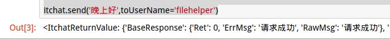

# Python打造微信聊天机器人
#### 1.图灵机器人
中文语境下智能度最高的机器人大脑
网址： (http://www.tuling123.com/)
先注册账号，再创建一个机器人。

#### 2.itchat模块
1. 说明：itchat是一个开源的微信个人号接口，轻松使用Python调用微信。
2. 文档：https://itchat.readthedocs.io/zh/latest/

#### 3.初步使用
Python3安装itchat模块：
```
$ pip install itchat
```
验证模块是否安装成功：
```Python
import itchat

#登录微信
itchat.auto_login(hotReload=True)

itchat.send('晚上好',toUserName='filehelper')
```
上面的代码会产生一个二维码，然后通过微信扫码登录，再给自己的文件助手发消息：



##### 1.发送图片消息
**代码：**
```python
itchat.send("@img@图片的路径和名字",toUserName="接收对象的名字")
```
**发送、接收成功：**


##### 2.获取好友列表，发消息
```python
friends = itchat.get_friends(update=True)
```
这些代码可以获取到所有好友的所有信息，第一个是自己。
```python

#获取所有好友
friends = itchat.get_friends(update=True)#获取所有好友
item = friends[0]#第一个是自己，下标为0
print(item['NickName'],item['Province'],item['UserName'])#查看相关信息
itchat.send('晚上好 %s' % (item['NickName']),toUserName=item['UserName']) #给自己发消息

#获取特定好友
hyb = itchat.search_friends(remarkName='韩应波')#通过备注查找，也可以通过其他项查找
print(hyb)
#给好友发消息、图片
print(hyb[0]['NickName'],hyb[0]['UserName'])
itchat.send('晚上好 %s' % (hyb[0]['NickName']),toUserName=hyb[0]['UserName'])
itchat.send("@img@1024.jpg",toUserName=hyb[0]['UserName'])
```
**发送成功**


#### 3.增加自动回复功能
```Python
import itchat
from itchat.content import *

#回复特定的消息
@itchat.msg_register(INCOME_MSG)
def text_reply(msg):
    print(msg)
    if not msg["FromUserName"]==myUserName:
        if msg['Text']==['你好']:
            return "你好啊"
        return "不知道你在说什么，请说的明白些"
    else:
        return "正在努力写代码中，请勿打扰"

#登录微信
if __name__ == "__main__":
    try:
        itchat.auto_login(hotReload=True)
        myUserName = itchat.get_friends(update=True)[0]['UserName']
        itchat.run() #运行监控进程，检查消息
    except:
        print("出错啦")
```
#### 4.图灵机器人
##### 1.单独实现：
```python
import itchat
from itchat.content import *
import requests

KEY = '9b4f1b38b0ce4c17a74092345112b03f' #注册图灵机器人的APIkey
UID = '148947' #用户名

def get_reply(msg):
    api_tuling = 'http://www.tuling123.com/openapi/api'
    data = {
        'key': KEY,
        'info': msg,
        'userid': UID
    }
    try:
        ret = requests.post(api_tuling,data=data).json()
        return ret.get('text')
    except:
        return
rs = get_reply('讲个笑话')
print(rs)
```
**运行结果：**


更多信息在：(http://www.tuling123.com/help/h_cent_klOapi.jhtml?nav=doc) 相当详细。

#### 5.微信和图灵机器人结合
目前暂时实现了单人聊天回复功能，群聊功能以后需要的话再添加。
**展示一下成果：**

**1.我的机器人接收到的消息:**


**2.机器人的回复:**


#### 更多功能
目前，还不支持语音，视频等功能。不过这些功能我后续都会加上的。
国庆节假期到了，给自己放两天假吧。