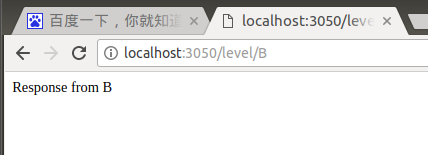

# 使用Response

## 发送下载响应
    Express包括res.download()方法，该方法的工作原理非常类似于res.sendFile()方法，只有少数差异。res.download()方法把文件作为HTTP响应的附件发送，这意味着Content-Disposition(内容处置)标头是设置的。res.download()方法采用以下语法：res.download(path,[filename],[callback])
    path 参数指向发送到客户端的文件。filename参数可以指定一个应该在Content-Disposition标头中发送的不同的文件名。回调函数在文件下载完成后执行。
   
## 重新定向
    当你实现一个Web服务器时，你可能需要把来自客户端的请求重定向在同意台服务器上的一个不同位置，或完全不同的服务器上。res.redirect(pact)方法负责处理重定向到一个新位置的请求。
    代码展示：

```javascript
var express = require('express');
var url = require('url');
var app = express();
app.listen(3050);
app.get('/google', function (req, res) {
	res.redirect('http://baidu.com');
});

app.get('/first', function (req, res) {
	res.redirect('/second');
});

app.get('/second', function (req, res) {
	res.send("Response from second");
});
app.get('/level/A', function (req, res) {
	res.redirect("./B");
});

app.get('/level/B', function (req, res) {
	res.send("Response from  B");
});
```
结果Successed：



## 完结