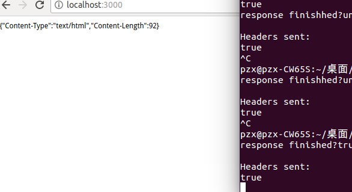
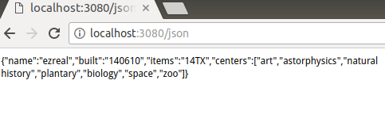
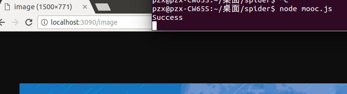

# Node使用Response对象
## 设置标头

   设置标头是制定适当的HTTp响应的一个重要组成部分。例如，设置Content-Type标头告诉浏览器如何处理响应。Response对象提供了几个辅助方法来获取和设置所发送的HTTP响应的标头值。
   最常用的方法是get(header)和set(header,value),它们分别获取和设置任何标头值。例如，下面的代码首先获取Content-Type标头，然后将其设置：
   ```javascript
   var oidType= res.get("Content-Type");
   res.set('Content-Type', 'text/plain');
   ```
   
## 设置状态
   如果响应的HTTP状态是200以外的值，那么你需要设置它。发送正确的状态响应，从而使浏览器或其他应用程序可以正确地处理HTTP响应是很重要的。要设置状态响应，应该使用status(numbers)方法，其中number参数是在HTTP规范中定义的HTTP响应状态。例如：下面的行设置不同的状态：
   
   ```javascript
   res.status(200); //OK,正确
   res.status(300); //Redirection重定向
   res.status(400); //Bad Request 错误的请求
   res.status(401); //Unauthorized 未经许可
   res.status(403); //Forbidden 禁止
   res.status(500); //Server Error 服务器错误
   ```
   
## 发送响应
   send()方法可以使用下列格式，其中status是HTTP状态代码，body是一个String或Buffer对象：
   
   ```javascript
   res.send(status, {body})
   res.send({body})
   ```
   如果指定Buffer对象，则内容类型被自动设置为application/octet-stream(应用程序/八位字节流)；除非你明确地将其设置为别的东西。例如：
   ```javacript
   res.set('Content_Type', 'text/html');
   res.send(new Buffer('<html><body>HTMl String</body></html>'));
   ```
   
   
## 发送JSON响应
使用jSON数据从服务器传输信息到客户端，然后客户端动态填充也面上的HTML元素，而不是让服务器构建HTML文件或HTML文件的一部分，并把HTML发送到客户端，这是一个日益增长的趋势。Express在Response对象上提供了json()和jsonp()方法，它们可以方便而漂亮地发送JSON。这些方法都采用类似send（）的语法，但正文是一个JSON字符串化的JavaScript对象：

```javascript
res.json(status,[object])
res.json([body])
res.jsonp(status, [object])
res,jsonp([object])
```
json.js运行结果:


## 发送文件
在Express中有一个出色的辅助方法，即Response对象上的sendfile(dilepath)方法。sendfiel()使用一个函数调用来完成将文件发送到客户端需要做的全部事情。具体来说，sendfile()方法执行以下操作:

* 基于文件拓展名设置Content-Type标头类型。
* 设置其他相应的标头，如Content-Length(内容长度)。
* 设置响应的状态。
* 使用Response对象内部的连接，把文件的内容发送到客户端。

sendfile()方法使用以下语法:

```javascript
res.sendfile(path, [option], [callback])
```

sendfile.js运行结果:

