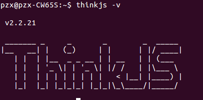
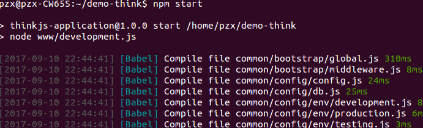
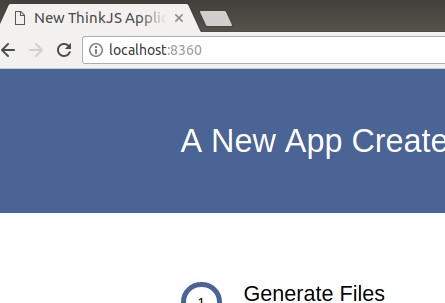

# Node.js MVC框架——ThinkJS

### 安装thinkjs

```
pzx@pzx-CW65S:~$ sudo npm install -g thinkjs@2 //
```

然后：

```
$ thinkjs -v //查看版本
```
这是我的版本：



### Hello Wordl!

```
pzx@pzx-CW65S:~$ thinkjs new demo-think //生成项目目录
pzx@pzx-CW65S:~$ cd demo-think //进入项目
pzx@pzx-CW65S:~/demo-think$ npm install //安装依赖
pzx@pzx-CW65S:~/demo-think$ npm start //启动项目
```

然后终端显示：



打开浏览器输入：localhost:8360,正常运行则显示：



