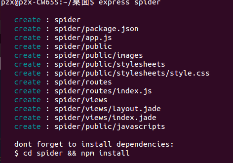
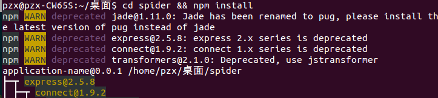
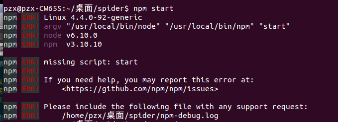
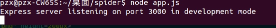
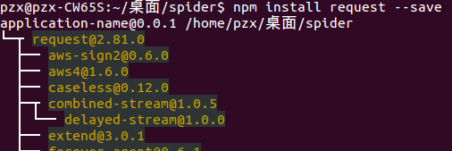
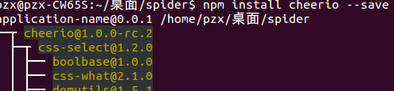
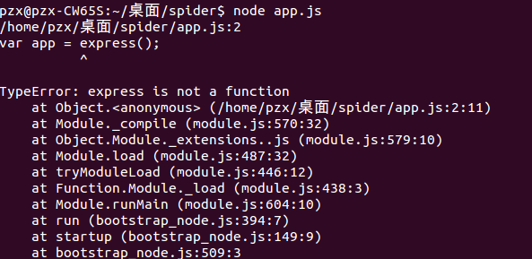
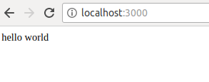
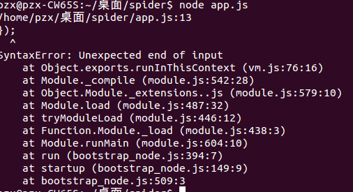
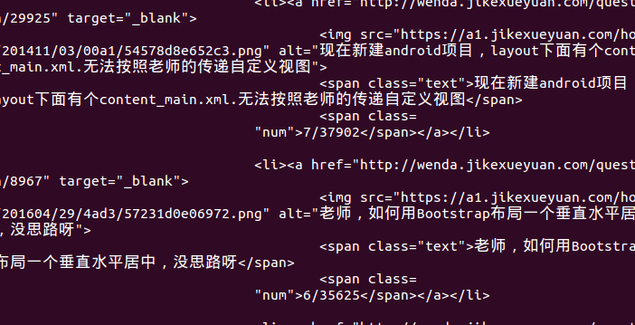

# Node爬虫系统
### 爬虫系统概要
* 爬虫以及Robots协议介绍
* 配置爬虫系统开发环境
* 爬虫实战

#### 爬虫系统及Robots协议
1. 爬虫，一种自动获取网页内容的程序。是搜索引擎的重要组成部分，因此搜索引擎很大程度上就是针对爬虫做出的优化。
2. robots.txt是一个文本文件，Robots.txt是一个协议，不是一个命令。它是爬虫要查看的第一个文件。

#### 配置爬虫系统开发环境
要用的Node模块：

* Express
* Request
* Cheerio

1. 创建项目目录：

```
$ express spider //spider是项目的名字,执行此步骤需要先安装Express
```

然后终端会呈现如此画面:

接下来:

```
$ cd spider && npm install //安装模块
```
期间出现了WARN:



这是因为一些旧的包不再使用。或者一些包改了名字。不影响使用。
模块安装完成后，在终端输入:

```
$ npm start
```
结果如下:



这是因为在新版本中不再使用“npm start”启动项目，而是使用“node app.js”

```
$ node app.js
```
终于成功启动了项目:



2.安装request

```
$ npm install request --save
```
安装成功：


3.安装cheerio

```
$ npm install cheerio --save
```
成功安装：


到此开发环境安装完成！

#### 爬虫实战
1. express使用方法
    
    ```javascript
    var express = require('express');
    var app = express();

    app.get('/', function(req, res){
       res.send('hello world');
    });

    app.listen(3000);
    ```
    [参考文档](http://www.expressjs.com.cn/4x/api.html)

2. request使用方法
    
   ```javascript
   var request = require('request');
   request('http://www.google.com', function (error, response, body) {
          console.log('error:', error); // Print the error if one occurred 
          console.log('statusCode:', response && response.statusCode);
          console.log('body:', body); 
      });
   ```
   把上面的代码简化一下，然后运行，出现了一个错误：
   
   
   
   然后我查阅了Express的官方文档，找到了解决方法：
   ```
   var app = express(); 改为>> var app = module.exports = express.createServer();
   ```
   再次运行，错误已经解决了：
   
   
   
   然后我在request中加入了想要爬取的网站，再次运行，又出错了：
   
   
   
   原来是少了符号"});",在该符号缺失的地方加上，再次运行，爬到了源代码：
   
   
   
   到目前为止，app.js的全部代码如下：
   ```javascript
   var express = require('express');
   var app = module.exports = express.createServer();
   var request = require('request');

   app.get('/', function (req, res) {
     request('http://www.jikexueyuan.com/', function (error, response, body) {
    if (!error && response.statusCode == 200) {
      console.log(body);
      res.send('hello world');
    }
     });
   });
  app.listen(3000);
   ```

3. cheerio使用方法

```javascript
const cheerio = require('cheerio')
const $ = cheerio.load('<h2 class="title">Hello world</h2>')
 
$('h2.title').text('Hello there!')
$('h2').addClass('welcome')
 
$.html()
```

[参考npmjs官网](https://www.npmjs.com/package/cheerio)

然后举一反三，通过它给的方法完善自己的爬虫

#### 结语
代码持续更新中、功能不断完善。
>Node爬虫>V1.0