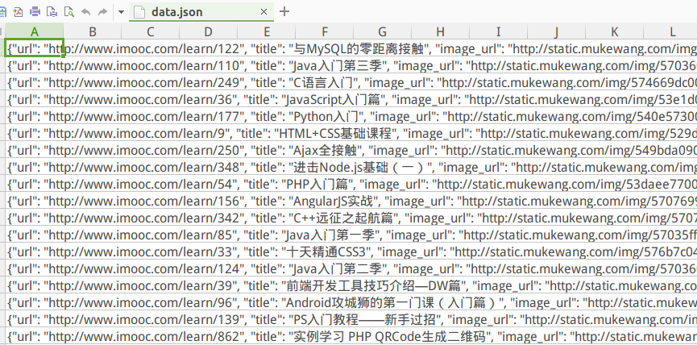
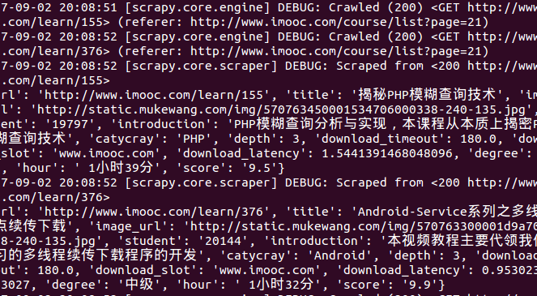

# Python——scrapy框架实现爬虫
## 基本介绍
#### 爬虫工作流程

#### 代码介绍
> MySpider.py>>这个文件主要是爬取所有需要的文件

> MyPipelines.py>>把爬取到的信息使用Pipeline进行处理然后储存


Pipeline进行了以下操作：
* 清理HTML数据
* 验证爬虫数据（检查item包含某些字段）
* 查重并丢弃
* 将结果保存到数据库中


#### 安装运行
```
把上述所需代码下载到你自己的目录
pzx@pzx-CW65S:~$ cd scrapytest/scrapytest/spiders //进入项目所在目录
pzx@pzx-CW65S:~/scrapytest/scrapytest/spiders$ scrapy crawl MySpider //运行项目
```

#### 版本控制
* V1.0.0 初步具有爬取功能，但是不能存储数据。

##### V1.0代码展示

```python
# -*- coding: utf-8 -*-
#引入文件
from scrapy.exceptions import DropItem
import json
import codecs

import MySQLdb
import MySQLdb.cursors
from twisted.enterprise import adbapi

class MyPipeline(object):
    def __init__(self):

        self.conn = MySQLdb.connect(user='root', passwd='123456', db='test', host='127.0.0.1', charset="utf8", use_unicode=True)
        self.cursor = self.conn.cursor()
    #pipeline默认调用
    def process_item(self, item, spider):

        try:
            self.cursor.execute("insert into mooc(title, student, catycray, degree, hour,score,introduction,url,image_url) values(%s, %s, %s, %s, %s, %s, %s, %s, %s)", (item['title'], item['student'], item['catycray'], item['degree'], item['hour'], item['score'], item['introduction'], item['url'], item['image_url']))
            self.conn.commit()
     
     
        except MySQLdb.Error, e:
            print "Error %d: %s" % (e.args[0], e.args[1])
        return item
            
    #异常处理
    def _handle_error(self, failue, item, spider):
        log.err(failure)
    #该方法在spider被开启时被调用。
    def open_spider(self, spider):
        pass
    #该方法在spider被关闭时被调用。
    def close_spider(self, spider):
        pass
```
* V1.1.0 增加数据存储功能


##### V1.1.0代码展示:
```python
# -*- coding: utf-8 -*-
#引入文件
from scrapy.exceptions import DropItem
import json
import codecs

import MySQLdb
import MySQLdb.cursors
from twisted.enterprise import adbapi

class MyPipeline(object):
    def __init__(self):

        self.conn = MySQLdb.connect(user='root', passwd='123456', db='test', host='127.0.0.1', charset="utf8", use_unicode=True)
        self.cursor = self.conn.cursor()

    #pipeline默认调用
    def process_item(self, item, spider):

        try:
            self.cursor.execute("insert into mooc(title, student, catycray, degree, hour,score,introduction,url,image_url) values(%s, %s, %s, %s, %s, %s, %s, %s, %s)", (item['title'], item['student'], item['catycray'], item['degree'], item['hour'], item['score'], item['introduction'], item['url'], item['image_url']))
            self.conn.commit()
     
     
        except MySQLdb.Error, e:
            print "Error %d: %s" % (e.args[0], e.args[1])
        return item
            
    #异常处理
    def _handle_error(self, failue, item, spider):
        log.err(failure)
    #该方法在spider被开启时被调用。
    def open_spider(self, spider):
        pass
    #该方法在spider被关闭时被调用。
    def close_spider(self, spider):
        pass
```
#### 运行结果1



### 结果展示2

