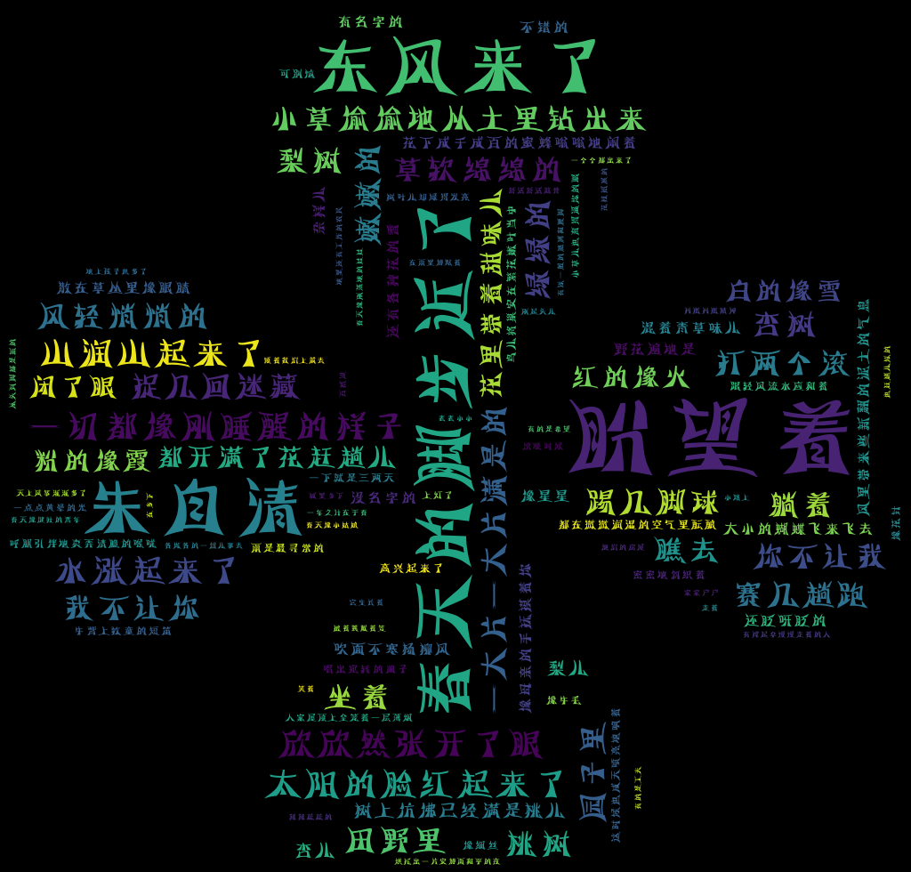

# Python数据分析——自定义词云
* 绘制词云所需要的库:

  * WordCloud,STOPWORDS
  * matplot
  * numpy
  * PIL

* 安装所需库:
 
 ```
 $ pip install wordcloud
 $ pip install matplot
 ...
 ```

* 绘制代码如下：

```python
#!/usr/bin/  python
#-*- conding: utf-8 -*-
from wordcloud import WordCloud, STOPWORDS
import matplotlib.pyplot as plt
import numpy as np
from PIL import Image
import random
def grey_color_func(word, font_size, position, orientation, random_state=None,**kwargs):
    return "hsl(0, 0%%, %d%%)" % random.randint(60, 100)

mask = np.array(Image.open('/home/pzx/study/images/03.png'))
text = open('/home/pzx/study/text/santi.txt').read()

text = text.replace(u"程心说", u"程心")
text = text.replace(u"程心和", u"程心")
text = text.replace(u"程心问", u"程心")

stopwords = set(STOPWORDS)
stopwords.add("int")
stopwords.add("ext")
stopwords.add(u"是的")

wc = WordCloud(font_path='/home/pzx/study/caidie.ttf', max_words=2000, mask=mask, stopwords=stopwords, margin=10, random_state=1, height=1200, width= 1000).generate(text)
default_colors = wc.to_array()
#plt.title('Custom colors')
#plt.imshow(wc.recolor(color_func=grey_color_func, random_state=3))
#wc.to_file("new_hope.png")
#plt.axis("off")
plt.figure()
plt.title("三体-词频统计")
plt.imshow(default_colors)
wc.to_file('santi.png')
plt.axis("off")
plt.show()
```

* 运行结果：



* 结语

是不是很漂亮啊？？自己动手试试吧。
